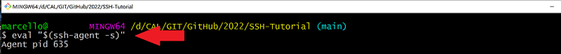
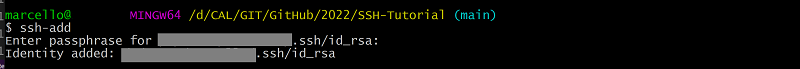

[10]: https://git-scm.com/downloads


SSH verstehen und anwenden
===================

Computer kommunizieren über Netzwerke miteinander. Daher wurde in der Vergangenheit eine Reihe von Regeln für die Kommunikation zwischen ICT-Systemen eingeführt und stetig weiterentwickelt.

Der erste dafür eingesetzte Dienst war **Telnet**. Dieser Dienst ist jedoch nicht sicher. Telnet übermittelt Daten im **Klartext**. Das heisst; die übertragenen Daten können, falls abgefangen, ohne weiteren Aufwand gelesen werden. Um genau dieses Problem zu lösen, wurde Mitte der 90er Jahre ein **sichereres** Protokoll namens **SSH** entwickelt und als zuverlässiger Nachfolger des Telnet-Protokolls eingeführt. Daten die mit **SSH** übermittelt werden, sind verschlüsselt (encrypted) und können nicht ohne entsprechenden **Schlüssel** gelesen (decrypted) werden. 

Dieses Tutorial soll helfen, **SSH** zu verstehen und praktisch anzuwenden. Es wird empfohlen, auch die Praxisbeispiele durchzuarbeiten, um das Wissen zu festigen. 
Diese **Skills** gehören, ähnlich wie z.B. **Netzwerkgrundlagen**, zum unverzichtbaren **Basiswissen** eines Informatikers.

### Lernziel

**SSH** richtig verstehen und praktisch anwenden

### Voraussetzungen

* Host (PC/Notebook mit min. 8 GB freiem RAM)
* Ausreichend Platz auf dem Host, um virtuelle Maschinen zu erstellen *(mind. 40GB freier HD- oder SSD-Speicher, falls kein Zugriff auf TBZ-Cloud, AWS-Cloud oder Azure-Cloud)*
* Einfache Linux-Kenntnisse (alles notwendige dazu weiter unten)
* Internetanschluss *(allenfalls VPN-Zugang zu Cloud-Umgebung)*


### Terminal (Kommandozeile) 

 

Die meisten Arbeiten erfolgen auf der Kommandozeile; hier als **Terminal** (*Bash*) bezeichnet. In diesem Tutorial wird die **Git-Bash** ([Download-URL][10]) auf einem Windows-System eingesetzt.

In der Kommandozeile bzw. im Terminal läuft die "Bash" Shell. Das ist nur die Shell von Linux und noch kein vollständiges Linux System. 

Diese Umgebung wird verwendet, weil benötige Programme wie `git`, `ssh-keygen` in der Powershell nicht zur Verfügung stehen. 


#### Inhaltsverzeichnis

* 01 - [Wichtige Linux-Kommandos](#-01---Wichtige-Linux-Kommandos)
* 02 - [SSH Keypair erstellen](#-02---SSH-Keypair-erstellen)
* 02 - [Git Client](#--02---git-client)
* 03 - [VirtualBox](#--03---virtualbox)
* 04 - [Vagrant](#--04---vagrant)
* 05 - [Zentrale SSH Konfigurationsfiles](#-02---Zentrale-SSH-Konfigurationsfiles)
* 06 - [Quellenverzeichnis](#-06---quellenverzeichnis)


___

 01 - Wichtige Linux-Kommandos 
======

> [⇧ **Nach oben**](#inhaltsverzeichnis)

#### Unix-Befehle

Um sich im Filesystem zurechtzufinden, sind folgende Unix-Commands nützlich:
* `pwd` zeigt den aktuellen Pfad an.
* `cd /Verzeichnis` wechselt in Verzeichnis z.B. `cd /Users`, alternativ kann die Windows Schreibweise in " verwendet werden, z.B. `cd "C:\Users"`
* Alternativ kann im Windows Explorer jederzeit ein Terminal mittels rechter Maustaste und `Git Bash Here` geöffnet werden.
* `cd ~` Wechsel ins eigene Home-Verzeichnis. 
* `cd -` wird auf das zuletzt verwendete Verzeichnis gewechselt.
* Die Laufwerke von Windows stehen als `/c`, `/d/` zur Verfügung, Bsp. `cd /c/Users` und `cd "C:\Users"` sind indentisch
* `ls -l` zeigt die Dateien im aktuellen Verzeichnis an
* `ls -al` zeigt sämtliche Dateien im aktuellen Verzeichnis an (auch die versteckten, wie z.B. **.ssh**, wo sämtliche Keys abgelegt werden)
* Die Windows Befehle stehen auch im Terminal zur Verfügung, z.B. `notepad README.md` 
 


___

 02 - SSH Keypair erstellen 
======

> [⇧ **Nach oben**](#inhaltsverzeichnis)


### SSH-Keys lokal erstellen (z.B. auf Laptop)
***

1.  Terminal (*Bash*) öffnen
2.  Folgenden Befehl mit der Account-E-Mail von GitHub einfügen:
    ```Shell
      $  ssh-keygen -t rsa -b 4096 -C "livio.brugger@edu.tbz.ch"
    ```
3. Neuer SSH-Key wird erstellt:
    ```Shell
      Generating public/private rsa key pair.
    ```
4. Bei der Abfrage, unter welchem Namen der Schlüssel gespeichert werden soll, die Enter-Taste drücken (für Standard):
    ```Shell
      Enter a file in which to save the key (~/.ssh/id_rsa): [Press enter]
    ```
5. Nun kann ein Passwort für den Key festgelegt werden. Es wird empfohlen dieses zu setzen und anschliessend dem SSH-Agent zu hinterlegen, sodass keine erneute Eingabe (z.B. beim Pushen) notwendig ist:
    ```Shell
      Enter passphrase (empty for no passphrase): [Passwort]
      Enter same passphrase again: [Passwort wiederholen]
    ```

### SSH-Key dem SSH-Agent hinzufügen 
***

**Windows und Linux**

1.  SSH-Agenten starten:
    ```Shell
      $ eval "$(ssh-agent -s)"
      Agent pid 635
    ```
    Beispiel:
   

2.  SSH-Agenten mit der aktuellen Shell "verlinken" - ist nicht persistent :
    ```Shell
      $ ssh-add 
    ```

    Beispiel:
   

    ...danach muss die korrekte "Passphrase" noch eingegeben werden


**macOS**

1.  Terminal (*Bash*) öffnen
2.  SSH-Agent starten:
    ```Shell
      $ eval "$(ssh-agent -s)"
      Agent pid 931
    ```
3.  Ab Version macOS High Sierra 10.12.2 muss das `~/.ssh/config` File angepasst werden, damit SSH-Keys automatisch dem SSH-Agent hinzugefügt werden:
    ```Shell
      $ sudo nano ~/.ssh/config
      
      Host *
      AddKeysToAgent yes
      UseKeychain yes
      IdentityFile ~/.ssh/id_rsa
    ```
4.  Nun muss der Schlüssel dem Agent nur noch hinzugefügt werden:
    ```Shell
      $ ssh-add -k ~/.ssh/id_rsa
    ```
5.  Der SSH-Key muss nun nur noch kopiert und anschliessend dem GitHub-Account hinzugefügt werden (siehe "SSH-Key hinzufügen"):
    ```Shell
      $ cat ~/.ssh/id_rsa.pub
      # Kopiert den Angezeiten Inhalt der id_rsa.pub Datei in die Zwischenablage
    ``` 

### SSH-Key hinzufügen
***
1.  Anmelden unter www.github.com
2.  Auf Benutzerkonto klicken (oben rechts) und den Punkt <strong>Settings</strong> aufrufen
3.  Unter den Menübereichen auf der linken Seite zum Abschnitt <strong>SSH und GPG keys</strong> wechseln
4.  Auf <strong>New SSH key</strong> klicken
5.  Im Formular unter <strong>Title</strong> eine Bezeichnung vergeben (z.B. MB SSH-Key)
6.  Den zuvor kopierten Key mit <i>CTRL + V</i> einfügen und auf <strong>Add SSH key</strong> klicken
7.  Der Schlüssel (SSH-Key) sollte nun in der übergeordneten Liste auftauchen


> Weiter Infos zu SSH-Keys in Zusammenhang mit GitHub und dem SSH-Agent findet man unter:

> **GitHub-Help:**  https://help.github.com/articles/generating-a-new-ssh-key-and-adding-it-to-the-ssh-agent/

> **Wikipedia:**    https://en.wikipedia.org/wiki/Ssh-agent


___

 05 - Zentrale SSH Konfigurationsfiles 
======

> [⇧ **Nach oben**](#inhaltsverzeichnis)

Hier kommt noch Text rein

Damit die Arbeiten lokal auf dem eigenen PC erfolgen können, muss der sogenannte "Git Client", auf Windows "Git/Bash" installiert werden. Dieser ermöglicht uns,
Cloud-Repositories zu klonen, zu pullen (herunterladen) oder ein lokales Repository zu pushen (hochladen).

Hierzu müssen folgende Schritte durchgeführt werden: 

### Client installieren
***
1. Für die Client-Installation muss der Installer unter [dieser Webseite](https://git-scm.com/downloads) heruntergeladen werden 
2. Die Installation erfolgt GUI-basiert, jedoch Standard (ohne speziellen Anpassungen). Daher wird an dieser Stelle auf eine Erklärung verzichtet.
3. Sobald der Vorgang abgeschlossen wurde, kann mit der Konfiguration fortgefahren werden.
