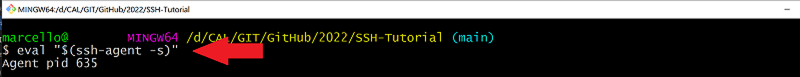
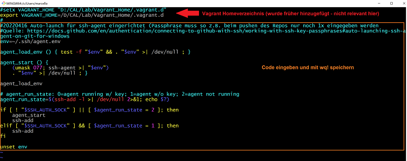
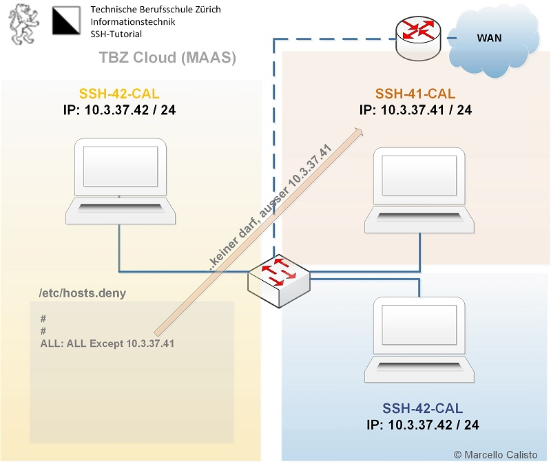
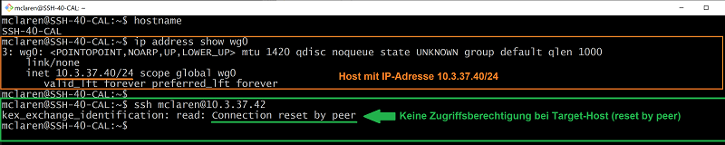
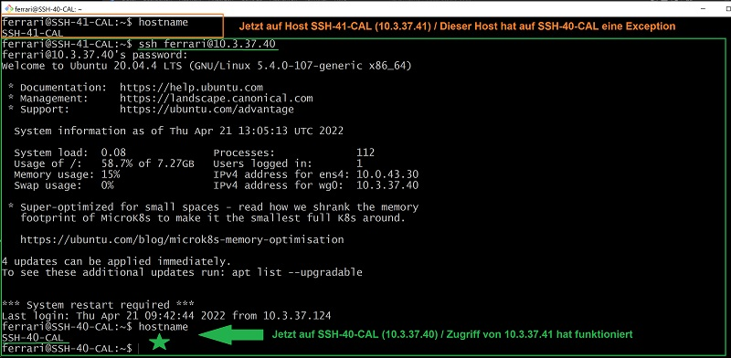
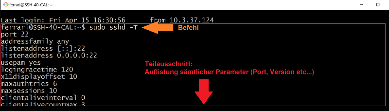

[10]: https://git-scm.com/downloads
[20]: https://docs.github.com/en/authentication/connecting-to-github-with-ssh/working-with-ssh-key-passphrases#auto-launching-ssh-agent-on-git-for-windows


Inhaltsverzeichnis
====
* 01 - [Wichtige Linux-Kommandos](#-01---wichtige-linux-kommandos)
* 02 - [SSH-Keys und SSH-Agent](#-02---ssh-keys-und-ssh-agent)
* 03 - [Zentrale SSH Konfigurationsfiles](#-03---zentrale-ssh-konfigurationsfiles)
* 06 - [Quellenverzeichnis](#-06---quellenverzeichnis)

<br><br>
___

 01 - Wichtige Linux-Kommandos 
======

> [⇧ **Nach oben**](#inhaltsverzeichnis)

#### Unix-Befehle

Um sich im Filesystem zurechtzufinden, sind folgende Unix-Commands nützlich:
* `pwd` zeigt den aktuellen Pfad an.
* `cd /Verzeichnis` wechselt in Verzeichnis z.B. `cd /Users`, alternativ kann die Windows Schreibweise in " verwendet werden, z.B. `cd "C:\Users"`
* Alternativ kann im Windows Explorer jederzeit ein Terminal mittels rechter Maustaste und `Git Bash Here` geöffnet werden.
* `cd ~` Wechsel ins eigene Home-Verzeichnis. 
* `cd -` wird auf das zuletzt verwendete Verzeichnis gewechselt.
* Die Laufwerke von Windows stehen als `/c`, `/d/` zur Verfügung, Bsp. `cd /c/Users` und `cd "C:\Users"` sind indentisch
* `ls -l` zeigt die Dateien im aktuellen Verzeichnis an
* `ls -al` zeigt sämtliche Dateien im aktuellen Verzeichnis an (auch die versteckten, wie z.B. **.ssh**, wo sämtliche Keys abgelegt werden)
* Die Windows Befehle stehen auch im Terminal zur Verfügung, z.B. `notepad README.md` 
 
<br><br>

___

 02 - SSH-Keys und SSH-Agent 
====

> [⇧ **Nach oben**](#inhaltsverzeichnis)


### SSH Keypair erstellen
(z.B. auf persönlichem Laptop)

Als erstes muss ein SSH-Keypair (Private/Public-Key) erstellt werden. 
Der **Private-Key** wird persönlich verwaltet und sollte **niemals** weitergegeben werden.
Der **Public-Key** (Endung .pub) kann  weitergegeben werden und ist somit auch für alle einsehbar. 

1.  Terminal (*Bash*) öffnen

2.  Folgenden Befehl mit der Account-E-Mail von GitHub einfügen:
    ```Shell
      $  ssh-keygen -t rsa -b 4096 -C "livio.brugger@edu.tbz.ch"
    ```
3. Neuer SSH-Key wird erstellt:
    ```Shell
      Generating public/private rsa key pair.
    ```
4. Bei der Abfrage, unter welchem Namen der Schlüssel gespeichert werden soll, die Enter-Taste drücken (für Standard):
    ```Shell
      Enter a file in which to save the key (~/.ssh/id_rsa): [Press enter]
    ```
5. Nun kann ein Passwort für den Key festgelegt werden. Es wird empfohlen dieses zu setzen und anschliessend dem SSH-Agent zu hinterlegen, sodass keine erneute Eingabe (z.B. beim Pushen) notwendig ist:
    ```Shell
      Enter passphrase (empty for no passphrase): [Passwort]
      Enter same passphrase again: [Passwort wiederholen]
    ```

--- 
### SSH-Key dem SSH-Agent hinzufügen 

Um das Abgleichen der Inhalte zwischen dem Origin und dem Main/Master-Repository zu beschleunigen, empfiehlt es sich, den SSH-Key dem SSH-Agent hinzuzufügen.
**Vorteil:** Man muss sich nur einmal authentifizieren und kann anschliessend Projektänderungen **ohne** Passwort oder Passphrase-Eingabe "pushen" oder "pullen". Ausserdem kann ich anschliessend ohne Authentifizierung auf sämtliche Rechner zugreifen, welche meinen Public-Key hinterlegt haben. Damit habe ich sehr schnell, sicher und sehr unkompliziert Zugriff auf sämtliche Systeme, die ich administriere. 

**Windows und Linux:**
Im folgenden Abschnitt werden zwei Varianten erklärt. Bei der ersten Variante muss der Ablauf bei jedem neuen Login durchgeführt werden (Non-Persistent). Bei der zweiten Variante wird ein Script in das .bash-profile eingefügt, welches beim Login des Benutzers automatisch ausgeführt wird (Persistent)

**Variante 1:** Non-Persistent (muss bei jedem Login neu ausgeführt werden)

1.  SSH-Agenten starten:
    ```Shell
      $ eval "$(ssh-agent -s)"
      Agent pid 635
    ```
    
    Beispiel:<br>
   

2.  SSH-Agenten mit der aktuellen Shell "verlinken":
    ```Shell
      $ ssh-add 
    ```

    Beispiel:<br>
   

    ...danach muss die korrekte "Passphrase" noch eingegeben werden (falls gesetzt)

    Achtung: dieses Vorgehen ist nicht persistent. Das heisst, dass diese Prozedur beim nächsten Login erneut durchgeführt werden muss:

<br>

**Variante 2:** Persistent - SSH-Agent startet nach dem Login automatisch (Code liegt im .bash_profile, welches bei jedem Login gleich zu Beginn ausgeführt wird). Passphrase muss nur einmal (am Anfang) eingegeben werden -  [Quelle][20]

1.  Bash_Profile sichern, bevor es geändert wird und anschliessend mit Editor öffnen:
    ```Shell
      $ cd ~
      $ cp .bash_profile .bash_profile.ORIG
      $ vi .bash_profile
    ```
    Beispiel:<br>
   

2.  Folgenden Code ins .bash_profile einfügen:
    ```Shell
      env=~/.ssh/agent.env
      agent_load_env () { test -f "$env" && . "$env" >| /dev/null ; }
      
      agent_start () {
        (umask 077; ssh-agent >| "$env")
        . "$env" >| /dev/null ; }

      agent_load_env

      # agent_run_state: 0=agent running w/ key; 1=agent w/o key; 2=agent not running
      agent_run_state=$(ssh-add -l >| /dev/null 2>&1; echo $?)

      if [ ! "$SSH_AUTH_SOCK" ] || [ $agent_run_state = 2 ]; then
        agent_start
        ssh-add
      elif [ "$SSH_AUTH_SOCK" ] && [ $agent_run_state = 1 ]; then
        ssh-add
      fi

      unset env

    ```
    Beispiel:<br>
   

**Check:**

Wenn alles korrekt konfiguriert worden ist, und der zugehörige Public-Key auf die zu verwaltenden Server verteilt wurde, kann ich nun von meinem Host aus per **SSH** auf alle diese Systeme zugreifen, **ohne** ein Passwort und **ohne** eine Passphrase einzugeben.

Wenn ich ja jetzt für den Verbindungsaufbau weder ein Passwort noch eine Passphrase benötige, stellt sich die Frage, ob dies ein Security-Issue darstellt. Die Antwort ist "**Nein**". Aber wie lautet die Begründung? 

Nun: Falls jemand in den Besitz unseres **Private-Keys** kommt, muss er oder sie zusätzlich noch die Passphrase kennen. Wir erinnern uns: Immer zu Beginn einer Session, also **vor** der Eingabe des **ersten** SSH-Befehls, **muss** die **Passphrase** eingegeben werden. In unserem Fall ist das System so konfiguriert, dass der **SSH-Agent** im **.bash_profile** automatisch gestartet wird. In der gleichen Codeabfolge wird ihm der Private-Key angehängt. Das funktioniert aber nur, wenn die entsprechende Eingabe mit der korrekten **Passphrase** übereinstimmt!

Dieses Verfahren ist also **sicher** und hilft uns anschliessend, **effizient** Code mit einem Repository abzugleichen (push/pull), oder **unkompliziert** auf andere Systeme zuzugreifen.


---

**macOS**

1.  Terminal (*Bash*) öffnen
2.  SSH-Agent starten:
    ```Shell
      $ eval "$(ssh-agent -s)"
      Agent pid 931
    ```
3.  Ab Version macOS High Sierra 10.12.2 muss das `~/.ssh/config` File angepasst werden, damit SSH-Keys automatisch dem SSH-Agent hinzugefügt werden:
    ```Shell
      $ sudo nano ~/.ssh/config
      
      Host *
      AddKeysToAgent yes
      UseKeychain yes
      IdentityFile ~/.ssh/id_rsa
    ```
4.  Nun muss der Schlüssel dem Agent nur noch hinzugefügt werden:
    ```Shell
      $ ssh-add -k ~/.ssh/id_rsa
    ```
5.  Der SSH-Key muss nun nur noch kopiert und anschliessend dem GitHub-Account hinzugefügt werden (siehe "SSH-Key hinzufügen"):
    ```Shell
      $ cat ~/.ssh/id_rsa.pub
      # Kopiert den Angezeiten Inhalt der id_rsa.pub Datei in die Zwischenablage
    ``` 


<br><br>
___

 03 - Zentrale SSH Konfigurationsfiles 
====

> [⇧ **Nach oben**](#inhaltsverzeichnis)

Es gibt verschiedene **Konfigurationsfiles**, die im Zusammenhang mit **SSH** eine Rolle spielen. 

Noch **bevor** der SSH-Daemon ins Spiel kommt, kann ich auf meinem System übergeordnete **Restriktionen** vornehmen. In folgenden Konfigurationsfiles kann ich definieren, wer Zugriff auf mein System erhält. Dabei kann ich von **grob** (ganze Topleveldomains oder Subnetze) bis **fein** (Einzelne Hosts oder einzelne Benutzer) Berechtigungen zuweisen oder entfernen.

### RSA rhost authentication 
  - /etc/hosts.allow
  - /etc/hosts.deny
  - /home/username/.rhosts
  - /home/username/.shosts

  ### Anwendungsfall

  Im folgenden Beispiel werden auf dem System **10.3.37.42** (Bild unten, gelbes Feld links) im **/etc/hosts.deny** sämtliche Zugriffe von "entfernten" Systemen unterbunden - mit einer Ausnahme: Das System mit der IP-Adresse **10.3.37.41** (Bild unten, oranges Feld oben rechts), welches mit einem "EXCEPT"-Eintrag von dieser Regel ausgeschlossen wird. Dieselbe Bedingung könnte auch erfüllt werden, wenn stattdessen ein entsprechender Eintrag im **/etc/hosts.allow** gemacht würde.

**Illustration:**

   


**Host: 10.3.37.42** wie folgt konfigurieren:

Konfigurationsfile mit Editor öffnen
```Shell
  $ sudo vi /etc/hosts.deny
```

Eintrag in der letzten Zeile
```Shell
  # /etc/hosts.deny: list of hosts that are _not_ allowed to access the system.
  #                  See the manual pages hosts_access(5) and hosts_options(5).
  #
  # Example:    ALL: some.host.name, .some.domain
  #             ALL EXCEPT in.fingerd: other.host.name, .other.domain
  #
  # If you're going to protect the portmapper use the name "rpcbind" for the
  # daemon name. See rpcbind(8) and rpc.mountd(8) for further information.
  #
  # The PARANOID wildcard matches any host whose name does not match its
  # address.
  #
  # You may wish to enable this to ensure any programs that don't
  # validate looked up hostnames still leave understandable logs. In past
  # versions of Debian this has been the default.
  # ALL: PARANOID
  ALL: ALL EXCEPT 10.3.37.41
```
<br>

**Versuch 1**: in diesem Fall funktioniert es **nicht** (Reset/Abbruch) <br>
Zugriff von **10.3.37.40** auf den Zielrechner **10.3.37.42**. Dieser Rechner hat **keine Exception** und darf somit **nicht zugreifen**:

Befehle auf System **10.3.37.40**:
```Shell
  $ ip address show wg0 #wg0 IP 10.3.37.40
  $ ssh mclaren@10.3.37.42 #Zugriff auf 10.3.37.42
```

Screenshot (Beispiel):<br>
   

Es erscheint die Meldung "Connection reset by peer". Der Verbindungsaufbau wurde somit abgebrochen; ich bleibe auf meinem Host.

<br>

**Versuch 2**: in diesem Fall funktioniert es (Success) <br>
Zugriff von **10.3.37.41** auf den Zielrechner **10.3.37.42**. Dieser Rechner hat **eine Exception** und darf somit **zugreifen**:

Befehle auf System **10.3.37.41**:
```Shell
  $ hostname #Wir befinden uns auf 
  $ ip address show wg0 #wg0 IP 10.3.37.41
  $ ssh mclaren@10.3.37.42 #Zugriff auf 10.3.37.42
```
Screenshot (Beispiel):<br>
   

Da ich zum ersten Mal von diesem Rechner zugreife, erscheint noch die Nachfrage, ob der Fingerprint des Systems akzeptiert werden möchte. Nach der Bestätigung werde ich zugelassen.


### SSH User keys location 
  - **/home/username/.ssh** <br>
    *hier sind die Keys (private & public), sowie die config und known-hosts-Datei abgelegt*.

    Das erstellen der Keys wurde bereits weiter oben erklärt. Hier noch en paar Informationen zur **known-hosts**-Datei.
    Immer wenn ich mit meinem Host zum erstem Mal auf ein anderes System zugreife, erhalte ich von diesem System einen "Fingerprint", den ich mit **yes** bestätigen muss, um mich erfolgreich darauf anzumelden. Hier ist es wichtig, dass man sich nochmals vergewissert, ob man auf das richtige System zugreift - denn nach der Bestätigung wird dieser Fingerprint in der persönlichen **known-hosts**-Datei abgelegt. Bei späteren Zugriffen auf diesen Zielhost geht das System deshalb davon aus, dass es sich um einen vertrauenswürdigen Rechner handelt.  
    Diese Abfrage kann z.B. **Man-in-the-Middle**-Angriffe vermeiden (dieselbe IP-Adresse eines Dritten würde nicht zugelassen). Es kann aber auch sein, dass z.B. ein DHCP-Server eine bereits bestätigte IP-Adresse einem anderen System zuweist und der Zugriff dadurch nicht mehr funktioniert. In solchen Fällen muss einfach der entsprechende Fingerprint im **known-hosts**-File gelöscht werden.  


### SSH configuration files 
  - **/etc/ssh/ssh_config** (Control Client verhalten)<br>
    Wenn man vom aktuellen Host auf ein anderes System zugreifen will, benutzt man den SSH-Client. In diesem Fall greifen die Settings im **ssh_config** (z.B. Portnummer, Protokoll-Version, Encryption-Algorythmus etc..)

  - **/etc/ssh/sshd_config** (Control Server verhalten)<br>
  Dieses Konfigurationsfile wird vom lokalen SSH-Daemon genutzt (der Dienst, welcher standardmässig auf dem SSH-Port horcht und Verbindungsanfragen von entfernten Systemen entgegennimmt).
  Beispiel: Wenn jemand von einem entfernten System via SSH auf unseren Host zugreifen will. 
  Damit dieser Zugriff funktioniert, müssen die Client-Settings auf dem anderen System mit den **sshd-config**-Settings übereinstimmen (z.B. Port-Nummer, Version etc...).
  
### SSH-Hardening:
Wenn man von SSH-Hardening spricht, dann ist insbesondere die Anpassung des Files **/etc/ssh/sshd_config** gemeint. Die folgende imperative Anleitung zeigt, wie Systeme im Enterprise-Umfeld gehärtet werden.

Bei der Bearbeitung einer Konfigurationsdatei können standardmäßig einige Optionen mit einem einzelnen Hash-Zeichen (**#**) am Anfang der Zeile auskommentiert werden. Um diese Optionen zu bearbeiten oder die kommentierte Option anerkennen zu lassen, muss man sie unkommentieren, indem man vorne einfach den Hash (**#**) entfernt.

Konfigurationsdatei sichern:
```Shell
  $ sudo cd /etc/ssh #Ins Verzeichnis wechseln
  $ sudo cp sshd_config sshd_config.ORIG #Sicherheitskopie des Configfiles
```
Bevor man die Konfigurationsdatei bearbeitet, können die aktuell festgelegten Optionen überprüft werden. Mit folgendem Befehl wird auf dem OpenSSH-Server ein erweiterter Testmodus ausgeführt, welcher die vollständige Konfigurationsdatei validiert und die effektiven Konfigurationswerte ausgibt.
```Shell
  $ sudo sshd -T #Validierung/Ausgabe sämtlicher Parameter
```
Screenshot (Beispiel):<br>
   

Als erstes muss für den Root-Account die Anmeldung über SSH **deaktiviert** werden:

```Shell
  $ vi /etc/ssh/sshd_config #Datei in einem Editor öffnen
```
Parameter **PermitRootLogin** auf **no** setzen
```Shell
  PermitRootLogin No
```

Das ist sehr wichtig, da es einen potenziellen Angreifer daran hindert, sich direkt als root anzumelden. Das unterstützt zudem gute betriebliche Sicherheitspraktiken wie das Operieren als nicht privilegierter Benutzer und die Verwendung von **sudo**, um Berechtigungen nur dann auszuweiten, wenn es unbedingt erforderlich ist.
Dieses Vorgehen ist inzwischen auch bei sämtlichen Banken in der Region Zürich "Best Practice". Da im **sudoers.conf** festgelegt wird, wer welche Rechte hat und sich alle via **sudo** authentifizieren müssen, wird zu jedem Zeitpunkt genau festgehalten, wer wann welches Kommando ausgeführt hat. Würden z.B. mehrere Administratoren Zugang zum Root-Passwort haben und wäre ein Root-Login erlaubt, wäre dies nicht möglich. 


  Wichtige Settings:


    


### Client installieren
***
1. Für die Client-Installation muss der Installer unter [dieser Webseite](https://git-scm.com/downloads) heruntergeladen werden 
2. Die Installation erfolgt GUI-basiert, jedoch Standard (ohne speziellen Anpassungen). Daher wird an dieser Stelle auf eine Erklärung verzichtet.
3. Sobald der Vorgang abgeschlossen wurde, kann mit der Konfiguration fortgefahren werden.
